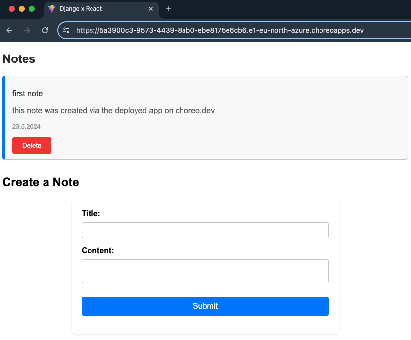

# Django x React App

**notice:**

The deployment link unfortunately won't work since choreo's free trial database powers off every hour and has to be manually powered back on. Let's just say that in my opinion choreo just seems not to be the best platform for public test deployments.

## Stack & Tools

## Features

Very basic app to create and delete notes just to practice or review some things:

- Connecting Django backend with React frontend
- Review jwt
- Axios http client
- Deploying Postgresql, Backend & Frontend on Choreo and connect them

Thanks to [Tech With Tim](https://www.youtube.com/@TechWithTim) for his [Tutorial](https://youtu.be/c-QsfbznSXI?si=E_3I_S1gi2zJxLPE) on this!

## Preview

